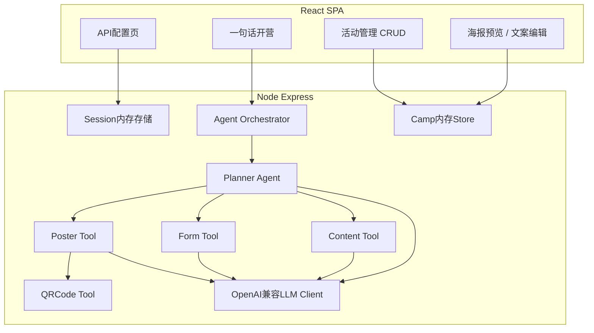

# 一键开营管家 — MVP 设计文档

> **项目名称：** CampAgent（运营提效引擎 —— 一键开营管家）  
> **文档版本：** v1.0  
> **日期：** 2026-07-10  
> **状态：** 已确认，待实现

---

## 1. 背景与目标

### 1.1 痛点

每次办训练营，运营人员需要手动完成以下工作：

- 建群、拉表
- 写招募文案
- 整理日程与每日打卡话术

整体耗时极长（约 **2 人天**），重复劳动多、易出错。

### 1.2 目标

开发一个自动化开营工作流平台，让运营人员：

1. 输入 **一句话需求**（如「下周五办一场面向新手的华为云数据库实战营」）
2. 系统自动生成：**HTML 招募海报**、**标准报名表单结构**、**每日群发打卡文案模板**
3. 在后台管理界面中对生成结果进行 **CRUD 编辑与导出**

**MVP 目标：** 将开营物料准备时间从 2 天压缩到约 **2 小时**（含人工微调）。

### 1.3 MVP 范围（已确认：选项 A）

| 包含 | 不包含（后续版本） |
|------|-------------------|
| Planner Agent 需求理解与任务拆解 | Operation Agent（报名监控、签到） |
| Poster / Form / Content / QRCode 四 Tool | Review Agent（自动复盘报告） |
| 活动 CRUD 管理界面 | 数据持久化、用户登录 |
| OpenAI 兼容大模型 API 对接 | 真实微信群/企微集成 |

---

## 2. 需求决策记录


以下决策来自 2026-07-10 需求讨论：

| 维度 | 决策 |
|------|------|
| 版本范围 | **A. 开营 MVP** |
| 前端 | React + TypeScript（Vite） |
| 后端 | Node.js + Express + TypeScript |
| 大模型对接 | **OpenAI 兼容接口**（用户填 Base URL + API Key + Model） |
| 海报交付 | **HTML 海报**（可预览、编辑、导出/下载，非静态图片） |
| 数据存储 | **无持久化**，单次会话内使用；刷新/关闭即丢失 |
| API Key | **仅当前会话**，后端内存持有，关闭页面清除 |

---

## 3. 系统架构

### 3.1 整体架构图



### 3.2 架构选型理由

采用 **Express 单体 + React SPA**，而非 Next.js 全栈或纯前端直连 LLM：

- API Key 只在后端 session 内存中，避免浏览器暴露与 CORS 问题
- Agent 编排、Prompt 模板、工具调用逻辑集中在后端，便于调试和扩展
- 与「React 前端 + Node 后端」技术诉求一致，MVP 交付最快
- 前端使用 Zustand 管理状态，轻量且适合中小型应用，避免 Redux 的复杂度

### 3.3 Agent 工作流（MVP 阶段）

```
用户输入一句话
       │
       ▼
Planner Agent（理解需求、拆解任务）
       │
 ┌─────┼─────┬─────────────┐
 ▼     ▼     ▼             ▼
Poster  Form  Content    QRCode
 Tool   Tool   Tool       Tool
 │     │     │             │
 ▼     ▼     ▼             ▼
HTML   报名   每日文案    二维码
海报   表单   模板
       │
       ▼
  活动创建完成 → 管理后台 CRUD
```

> **说明：** Operation Agent 与 Review Agent 为完整愿景，不在 MVP 范围内。

---

## 4. 核心用户流程

1. **配置 LLM** — 进入设置页，填写 Base URL / API Key / Model，点击「测试连接」
2. **一键开营** — 在开营页输入一句话需求，点击「一键开营」
3. **Planner 解析** — 系统将需求拆解为结构化计划（营名、受众、日期、天数、主题、亮点等）
4. **并行生成** — 三个 LLM Tool 并行调用，生成海报 HTML、表单结构、每日文案
5. **QR Code 注入** — 基于会话内报名预览 URL 生成二维码，嵌入 HTML 海报
6. **管理编辑** — 在活动详情页对海报、表单、文案进行 CRUD 编辑
7. **导出使用** — 下载 HTML 海报、复制表单 JSON、复制文案 Markdown
8. **会话结束** — 关闭浏览器，所有数据清除

---

## 5. 项目结构

```
CampAgent/
├── package.json              # monorepo workspaces 或根脚本
├── docs/
│   └── superpowers/
│       └── specs/            # 设计文档（本文件）
├── apps/
│   ├── web/                  # React + Vite + Ant Design
│   │   ├── src/
│   │   │   ├── pages/        # Config, Create, CampList, CampDetail
│   │   │   ├── components/   # PosterPreview, FormEditor, ContentEditor
│   │   │   ├── stores/       # zustand stores (campStore, configStore, uiStore)
│   │   │   └── api/          # axios 封装
│   └── server/               # Express + TypeScript
│       ├── src/
│       │   ├── routes/       # config, camps, generate
│       │   ├── agents/       # planner.ts, orchestrator.ts
│       │   ├── tools/        # poster, form, content, qrcode
│       │   ├── llm/          # openai-compatible client
│       │   ├── store/        # in-memory camp store (Map)
│       │   └── session/      # express-session memory store
│       └── prompts/          # 各 Tool 的 system/user prompt 模板
└── shared/
    └── types/                # Camp, FormField, ContentTemplate 等 TS 类型
```

---

## 6. 数据模型

所有数据存于内存，按 session 隔离，无数据库。

### 6.1 Camp（活动）

```typescript
interface Camp {
  id: string;
  userPrompt: string;
  plan: CampPlan;
  poster: {
    html: string;
    title: string;
    subtitle: string;
    bullets: string[];
  };
  form: FormField[];
  dailyContents: DailyContent[];
  registrationUrl: string;
  qrCodeDataUrl: string;
  status: 'draft' | 'ready';
  createdAt: string;
  updatedAt: string;
}
```

### 6.2 CampPlan（Planner 输出）

```typescript
interface CampPlan {
  campName: string;
  targetAudience: string;
  startDate: string;       // ISO 日期
  durationDays: number;
  theme: string;
  highlights: string[];
}
```

### 6.3 FormField（表单字段）

```typescript
interface FormField {
  name: string;
  label: string;
  type: 'text' | 'email' | 'phone' | 'select' | 'textarea';
  required: boolean;
  placeholder?: string;
  options?: string[];      // type=select 时
}
```

### 6.4 DailyContent（每日文案）

```typescript
interface DailyContent {
  day: number;
  title: string;
  message: string;         // 群发正文
  checkInPrompt: string;   // 打卡引导语
}
```

---

## 7. API 设计

| Method | Path | 说明 |
|--------|------|------|
| POST | `/api/config` | 设置 LLM 配置到 session，并测试连通性 |
| POST | `/api/camps/generate` | 接收 `prompt`，触发 Planner + Tools 全流程 |
| GET | `/api/camps` | 列出当前 session 内所有活动 |
| GET | `/api/camps/:id` | 获取单个活动详情 |
| PUT | `/api/camps/:id` | 更新 poster / form / dailyContents |
| DELETE | `/api/camps/:id` | 删除活动 |
| GET | `/api/camps/:id/poster.html` | 返回可下载的海报 HTML |
| GET | `/api/camps/:id/qrcode` | 返回 QR Code PNG |

### Session 策略

- 使用 `express-session` + `MemoryStore`
- `cookie.maxAge` 设为浏览器会话级（关闭即失效）
- LLM 配置与 `apiKey` 只存 session，API 响应中 **永不回传 Key**

---

## 8. Agent / Tool 实现要点

### 8.1 Planner Agent

- **输入：** 用户一句话
- **输出：** 严格 JSON（`CampPlan`）
- **实现：** Prompt 约束 + `response_format: json_object`（若模型支持）+ 后端 Zod 校验
- **失败处理：** 返回可读错误，允许用户修改 prompt 重试

### 8.2 Poster Tool → HTML 海报

- **LLM 输出：** `{ title, subtitle, bullets[], htmlTemplate }`
- **htmlTemplate 要求：** 内联 CSS、移动端友好、预留 `{{QR_CODE}}` 占位区
- **后处理：** 将 QR Code `dataUrl` 注入占位符
- **管理页：** HTML 编辑器 + iframe 实时预览 + 下载 `.html`

### 8.3 Form Tool

- **LLM 输出：** `FormField[]` 字段数组
- **前端：** Ant Design 动态表单渲染预览，支持增删改字段

### 8.4 Content Tool

- **输入：** `CampPlan.durationDays`
- **输出：** 按天生成 `{ day, title, message, checkInPrompt }`
- **管理页：** 逐日编辑 + 一键复制全部文案

### 8.5 QRCode Tool（非 LLM）

- **输入：** 会话内报名预览 URL（如 `http://localhost:5173/register/{campId}`）
- **输出：** Base64 PNG（`qrcode` 库）
- **用途：** 嵌入 HTML 海报

---

## 9. 前端页面规划

| 路由 | 页面 | 功能 |
|------|------|------|
| `/settings` | 设置页 | LLM 配置 + 测试连接 |
| `/` | 开营页 | 一句话输入 + 示例 prompt + 生成进度 |
| `/camps` | 活动列表 | 卡片列表，新建/删除 |
| `/camps/:id` | 活动详情 | Tab：海报 / 表单 / 文案 / 概览 |

### 活动详情 Tab 说明

- **海报** — iframe 预览 + HTML 编辑 + 下载
- **表单** — 字段 CRUD + 动态表单预览
- **文案** — 按日编辑 + 一键复制 Markdown
- **概览** — Planner 解析结果 + QR Code 展示

**UI 库：** Ant Design

### 状态管理

使用 **Zustand** 管理全局状态：

- **Camp Store** — 管理活动列表、当前活动详情、CRUD 操作状态
- **Config Store** — 管理 LLM 配置状态（API Key 仅存后端 session，前端只存配置状态）
- **UI Store** — 管理全局 UI 状态（加载中、错误提示、当前激活 Tab 等）

**优势：** 
- 轻量级，无 Provider 包裹，API 简洁
- 支持 TypeScript，类型推断友好
- 便于调试，支持 devtools 中间件

---

## 10. UI 设计规范

### 10.1 设计理念

**核心原则：灵动、现代、打破常规**

- 摒弃传统企业软件的蓝紫色调和方正布局
- 采用不规则形状、流动曲线、渐变叠加
- 营造年轻化、创新化的训练营氛围

### 10.2 配色方案

**主色调：暖色系 + 活力橙**

```
主色：#FF6B35（活力橙）
辅色：#F7C59F（暖杏色）
点缀：#2EC4B6（清新青绿）
背景：#FFFAF0（米白）/ #FFF5E6（浅杏）
文字：#2D3436（深灰）/ #636E72（中灰）
渐变：橙色 → 粉色 → 紫色的柔和过渡
```

**避免：** 传统蓝色(#1890FF)、紫色(#722ED1)、灰色背景

### 10.3 布局特色

**不规则形状元素：**

1. **卡片设计**
   - 使用 `border-radius` 不对称圆角（如 `20px 40px 20px 60px`）
   - 添加 `transform: rotate(-2deg)` 微倾斜
   - 卡片悬浮时轻微旋转和缩放

2. **背景装饰**
   - 使用 SVG 不规则 blob 形状作为背景装饰
   - 添加流动的渐变色块（CSS animation）
   - 模糊玻璃态效果（`backdrop-filter: blur`）

3. **按钮样式**
   - 胶囊形按钮（`border-radius: 50px`）
   - 渐变填充 + 柔和阴影
   - Hover 时形状微变（`scale` + `skew`）

4. **分割线**
   - 使用波浪线 SVG 代替直线
   - 或使用渐变色带倾斜分割

### 10.4 动效设计

**灵动交互：**

- **页面进入**：元素依次淡入 + 轻微上移（stagger animation）
- **卡片悬浮**：轻微旋转 + 阴影扩散 + 背景色渐变
- **按钮点击**：涟漪扩散效果 + 轻微缩放反馈
- **生成进度**：流动渐变进度条 + 脉冲动画
- **成功提示**：不规则形状 Toast 从侧边滑入

**实现工具：**
- CSS `@keyframes` + `transition`
- Framer Motion（React 动画库，可选）
- Lottie 轻量动画（用于加载状态）

### 10.5 组件设计示例

**海报预览卡片：**
```
┌─────────────────────────┐
│  ╭──────────────╮       │  ← 不规则圆角
│  │   海报预览    │       │
│  ╰──────────────╯       │
│  ━━━━━━━━━━━━          │  ← 波浪分割线
│  标题：华为云数据库实战营  │
│  [编辑] [下载]           │  ← 胶囊按钮
└─────────────────────────┘
     ↗ 轻微倾斜 3°
```

**活动列表：**
```
  ╭─╮                    ╭─╮
  │1│ 华为云数据库实战营   │5│ ← 不规则编号气泡
  ╰─╯                    ╰─╯
    ┌──────────────┐
    │  [海报] [表单] │  ← 标签式导航
    └──────────────┘
```

**一句话开营输入框：**
```
  ╭────────────────────────────╮
  │  💡 下周五办一场面向新手...  │  ← 大圆角 + 渐变边框
  ╰────────────────────────────╯
       [ ✨ 一键开营 ]          ← 渐变按钮 + 发光效果
```

### 10.6 响应式适配

- 移动端保持不规则形状，但减少倾斜角度
- 小屏幕下卡片改为纵向堆叠，圆角统一缩小
- 触摸设备增大点击区域，按钮最小高度 44px

### 10.7 设计工具与资源

**推荐工具：**
- Figma：原型设计 + 不规则形状绘制
- SVG Blob Generator：生成随机 blob 形状
- Coolors.co：配色方案生成
- CSS Gradient：渐变背景生成器

**图标库：**
- Phosphor Icons（线性风格，现代感强）
- 或 Lucide React（轻量，支持 React 组件）

---

## 11. 错误处理与安全

| 场景 | 处理方式 |
|------|----------|
| LLM 调用超时（30s） | 前端 Toast + 可重试 |
| 429 限流 / 无效 Key | 明确错误提示，引导检查配置 |
| Tool 输出 JSON 不合格 | Zod 校验失败 → 重试一次 → 降级部分成功 |
| API Key 泄露风险 | 仅存 session 内存，日志脱敏，响应不回传 |
| 数据持久化风险 | 无 DB，关闭浏览器即清除 |

---

## 12. 技术依赖

### Server

`express`, `express-session`, `cors`, `zod`, `uuid`, `qrcode`

### Web

`react`, `react-router-dom`, `antd`, `axios`, `zustand`, `framer-motion`, `lucide-react`, `@monaco-editor/react`（可选，MVP 可用 textarea）

### Dev

`typescript`, `vite`, `tsx`, `concurrently`

---

## 13. 开发阶段

| 阶段 | 内容 | 预估 |
|------|------|------|
| Phase 1 | 工程骨架：monorepo、Express session、React 路由 + Ant Design | 0.5 天 |
| Phase 2 | LLM 对接：OpenAI 兼容 Client、配置 API、Prompt 模板 | 0.5 天 |
| Phase 3 | Agent 编排：Planner + 三 Tool 并行、JSON 校验、generate 全流程 | 1 天 |
| Phase 4 | UI 设计实现：不规则形状组件、动效、配色方案落地 | 0.5 天 |
| Phase 5 | CRUD 界面：列表/详情、海报预览编辑、表单/文案编辑器、QR 注入 | 1 天 |
| Phase 6 | 联调 polish：进度 UI、空状态、README | 0.5 天 |
| **合计** | | **~4 天** |

---

## 14. 演示验收标准

- [ ] 用户配置 OpenAI 兼容 API 后可成功测试连接
- [ ] 输入一句话后 30–60 秒内生成完整开营物料
- [ ] 海报为可预览/编辑/下载的 HTML，含 QR Code
- [ ] 表单结构可在后台 CRUD 并预览
- [ ] 每日文案可按天编辑并复制
- [ ] 关闭浏览器后数据不保留（符合一次性会话设计）

---

## 15. 后续扩展（不在 MVP）

- SQLite / PostgreSQL 持久化、用户登录
- Operation Agent：报名监控、签到统计、完成率分析
- Review Agent：自动复盘、生成运营报告
- 海报模板库、多主题切换
- 企微 / 微信群真实集成

---

## 16. 附录：示例 Prompt

**用户输入：**

> 下周五办一场面向新手的华为云数据库实战营

**Planner 预期输出：**

```json
{
  "campName": "华为云数据库实战营",
  "targetAudience": "云计算/数据库新手",
  "startDate": "2026-07-17",
  "durationDays": 5,
  "theme": "华为云数据库从入门到实战",
  "highlights": [
    "零基础友好，手把手教学",
    "真实云环境实操",
    "每日打卡 + 社群答疑"
  ]
}
```
